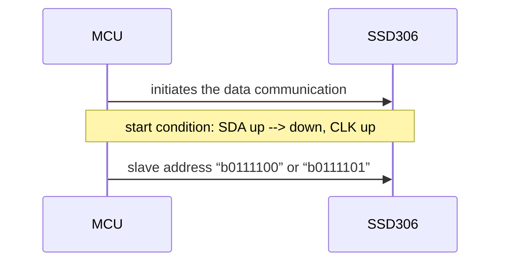
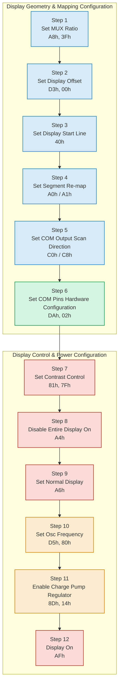

## Write mode for IIC
- 8.1.5.2 Write mode for I2C

```mermaid
sequenceDiagram
participant mcu as MCU
participant oled as SSD306

mcu ->> oled: initiates the data communication
note over mcu, oled: start condition: SDA up --> down, CLK up

mcu ->> oled: slave address “b0111100” or “b0111101”


```

```mermaid
flowchart TD
    %% LEFT COLUMN
    subgraph COL1["Display Geometry & Mapping Configuration"]
        direction LR
        S1[Step 1<br/>Set MUX Ratio<br/>A8h, 3Fh]
        S2[Step 2<br/>Set Display Offset<br/>D3h, 00h]
        S3[Step 3<br/>Set Display Start Line<br/>40h]
        S4[Step 4<br/>Set Segment Re-map<br/>A0h / A1h]
        S5[Step 5<br/>Set COM Output Scan Direction<br/>C0h / C8h]
        S6[Step 6<br/>Set COM Pins Hardware Configuration<br/>DAh, 02h]

        S1 --> S2 --> S3 --> S4 --> S5 --> S6
    end

    %% RIGHT COLUMN
    subgraph COL2["Display Control & Power Configuration"]
        direction LR
        S7[Step 7<br/>Set Contrast Control<br/>81h, 7Fh]
        S8[Step 8<br/>Disable Entire Display On<br/>A4h]
        S9[Step 9<br/>Set Normal Display<br/>A6h]
        S10[Step 10<br/>Set Osc Frequency<br/>D5h, 80h]
        S11[Step 11<br/>Enable Charge Pump Regulator<br/>8Dh, 14h]
        S12[Step 12<br/>Display On<br/>AFh]

        S7 --> S8 --> S9 --> S10 --> S11 --> S12
    end

    %% Cross-column flow
    S6 --> S7

    %% Styles
    classDef geometry fill:#D6EAF8,stroke:#2E86C1,stroke-width:1.5px
    classDef hardware fill:#D5F5E3,stroke:#239B56,stroke-width:1.5px
    classDef control fill:#FADBD8,stroke:#C0392B,stroke-width:1.5px
    classDef power fill:#FDEBD0,stroke:#D68910,stroke-width:1.5px

    %% Class assignment
    class S1,S2,S3,S4,S5 geometry
    class S6 hardware
    class S7,S8,S9,S12 control
    class S10,S11 power

```